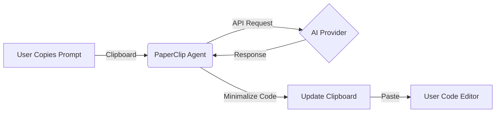

<div align="center">


# PaperClip
### The invisible AI agent living in your clipboard.

[](https://www.python.org/downloads/)
[](https://opensource.org/licenses/MIT)
[](http://makeapullrequest.com)

**Stop Alt-Tab-ing. Just copy, wait, and paste code.**

</div>

---

## ⚡ Why PaperClip?

Coding flows shouldn't be broken by browser tabs. **PaperClip** brings the power of LLMs directly to your clipboard. It runs silently in the background, watches for your commands, and swaps your prompt with code-only answers.

- **Zero UI**: Acts as a ghost in your shell.
- **Privacy First**: No clipboard history stored.
- **Resilient**: Automatic failover if an API key dies.

## 🤖 How It Works

It's magic. No, really.

1.  **Copy** a command: `agent.prompt write a quick sort in python`
2.  **Wait** a second... (The agent talks to the AI) ⏳
3.  **Paste**! The text in your clipboard is now the code you asked for.



## 🌟 Feature Highlights

| Feature | Description |
| :--- | :--- |
| **Silent Agent** 👻 | Runs in the terminal, works with ANY app where you can copy/paste. |
| **Smart Mode** 🧠 | `agent.prompt` for one-off tasks, `agent.promptall` for hands-free continuous prompting. |
| **Failover** 🛡️ | Define multiple API keys. If one fails, it tries the next one instantly. |
| **Clean Outputs** 🧹 | Automatically strips "Sure, here is the code..." fluff. You get just the code. |
| **JSON Storage** 💾 | Check `./sessions` for full logs if you need them. No database required. |

## 🚀 Quick Start

### 1. Install Dependencies
```bash
pip install aiohttp pyperclip
```

### 2. Configure Providers
Edit `providers.json` to add your keys (OpenRouter, local APIs, etc).

### 3. Run the Agent
```bash
python bot.py
```

*That's it. You are ready to roam.*

## ⌨️ Commands Cheat Sheet

Type these **instantly** into any text field and copy them to trigger the agent.

| Magic Command | Action |
| :--- | :--- |
| `agent.prompt <text>` | Sends `<text>` to the AI. |
| `agent.prompt` | Activates trigger. The *next* thing you copy will be sent. |
| `agent.promptall` | **God Mode**. Every single copy is sent to AI. |
| `agent.promptone` | Disables God Mode. Back to manual triggers. |
| `model.gem` | Switch priority to Gemini models. |
| `model.openr` | Switch priority to OpenRouter models. |

## ⚙️ Configuration

Your `providers.json` is the brain. Add as many models as you need:

```json
[
  {
    "id": "primary_gpt",
    "name": "OpenRouter GPT-4o",
    "base_url": "https://api.openrouter.ai",
    "api_key": "sk-or-...",
    "model": "openai/gpt-4o-mini",
    "priority": 1,
    "enabled": true
  }
]
```

## 🗺️ Roadmap

- [x] Basic Clipboard Interception
- [x] Provider Failover
- [x] Code Minimalization
- [ ] GUI Dashboard (Optional)
- [ ] Local LLM Support (Ollama)
- [ ] Voice Trigger Support

## 📜 License

Free to use, modify, and hack. Just don't upload your `providers.json`!